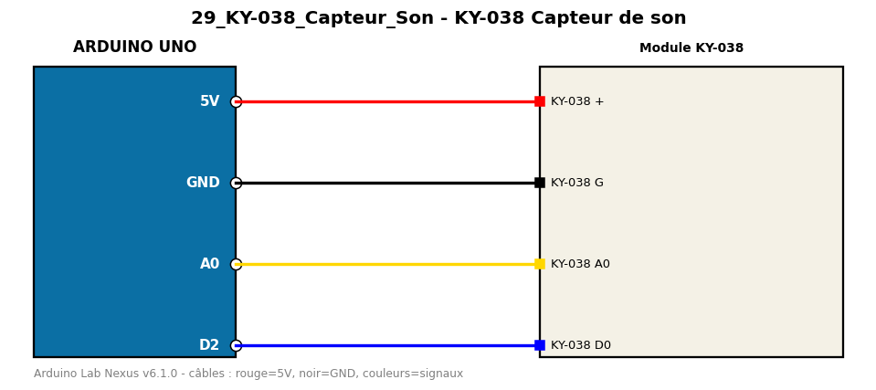

# KY-038 Capteur de son

Affiche le niveau sonore analogique et détecte les bruits forts via la sortie numérique.

**Composants :** Module KY-038

**Bibliothèques :** aucune

| Arduino | Composant | Couleur fil |
|---|---|---|
| 5V | KY-038 + | red |
| GND | KY-038 G | black |
| A0 | KY-038 A0 | gold |
| D2 | KY-038 D0 | blue |

Moniteur série : 9600 bauds. Toujours câbler **carte débranchée**.
