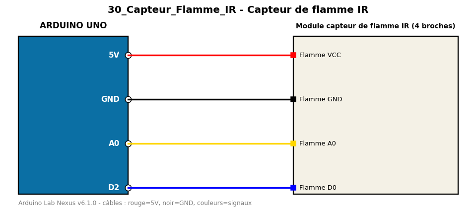

# Capteur de flamme IR

Détecte une flamme par infrarouge et affiche l'intensité mesurée.

**Composants :** Module capteur de flamme IR (4 broches)

**Bibliothèques :** aucune

| Arduino | Composant | Couleur fil |
|---|---|---|
| 5V | Flamme VCC | red |
| GND | Flamme GND | black |
| A0 | Flamme A0 | gold |
| D2 | Flamme D0 | blue |

Moniteur série : 9600 bauds. Toujours câbler **carte débranchée**.
