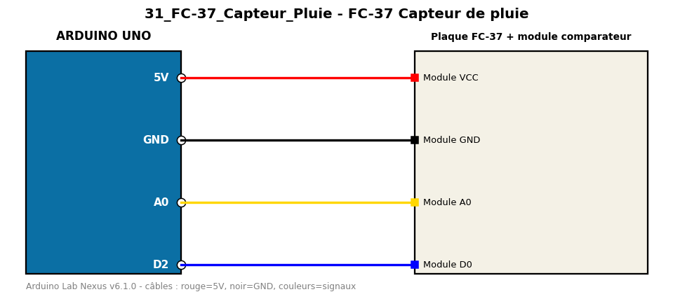

# FC-37 Capteur de pluie

Mesure la quantité d'eau sur la plaque de pluie et indique s'il pleut.

**Composants :** Plaque FC-37 + module comparateur

**Bibliothèques :** aucune

| Arduino | Composant | Couleur fil |
|---|---|---|
| 5V | Module VCC | red |
| GND | Module GND | black |
| A0 | Module A0 | gold |
| D2 | Module D0 | blue |

Moniteur série : 9600 bauds. Toujours câbler **carte débranchée**.
