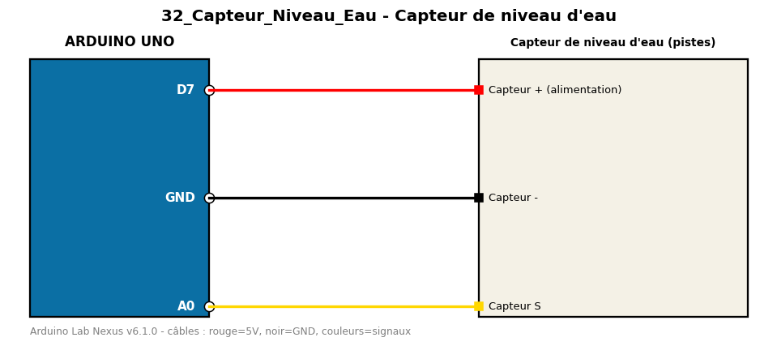

# Capteur de niveau d'eau

Mesure le niveau d'eau avec un capteur à pistes et l'affiche en pourcentage.

**Composants :** Capteur de niveau d'eau (pistes)

**Bibliothèques :** aucune

| Arduino | Composant | Couleur fil |
|---|---|---|
| D7 | Capteur + (alimentation) | red |
| GND | Capteur - | black |
| A0 | Capteur S | gold |

Moniteur série : 9600 bauds. Toujours câbler **carte débranchée**.
