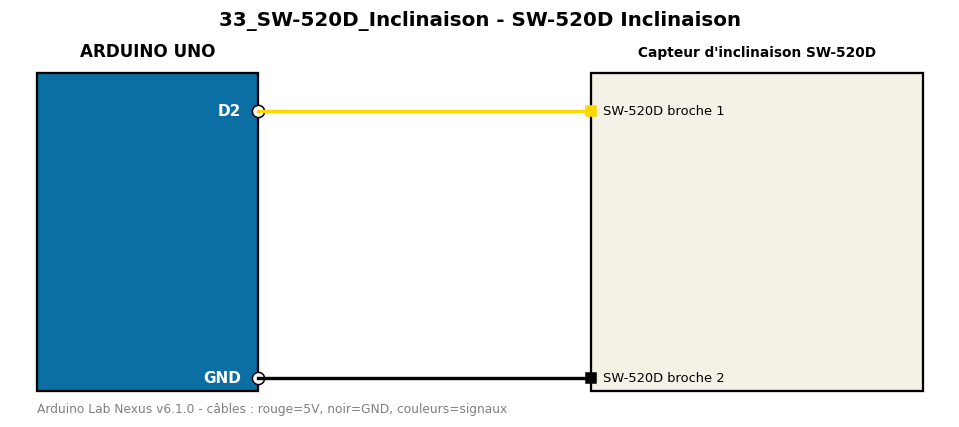

# SW-520D Inclinaison

Détecte l'inclinaison d'un capteur à bille SW-520D avec anti-rebond logiciel.

**Composants :** Capteur d'inclinaison SW-520D

**Bibliothèques :** aucune

| Arduino | Composant | Couleur fil |
|---|---|---|
| D2 | SW-520D broche 1 | gold |
| GND | SW-520D broche 2 | black |

Moniteur série : 9600 bauds. Toujours câbler **carte débranchée**.
