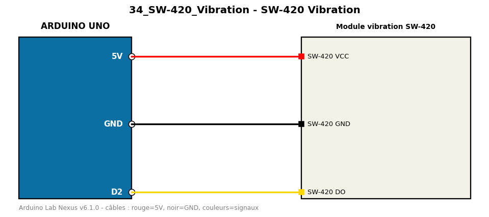

# SW-420 Vibration

Détecte les vibrations et compte le nombre de chocs avec un module SW-420.

**Composants :** Module vibration SW-420

**Bibliothèques :** aucune

| Arduino | Composant | Couleur fil |
|---|---|---|
| 5V | SW-420 VCC | red |
| GND | SW-420 GND | black |
| D2 | SW-420 DO | gold |

Moniteur série : 9600 bauds. Toujours câbler **carte débranchée**.
