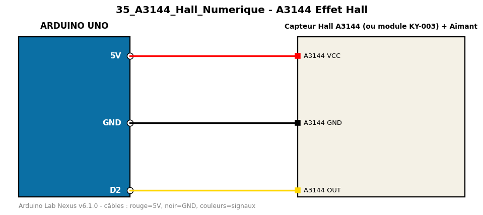

# A3144 Effet Hall

Détecte la présence d'un aimant avec un capteur à effet Hall A3144 (sortie numérique).

**Composants :** Capteur Hall A3144 (ou module KY-003), Aimant

**Bibliothèques :** aucune

| Arduino | Composant | Couleur fil |
|---|---|---|
| 5V | A3144 VCC | red |
| GND | A3144 GND | black |
| D2 | A3144 OUT | gold |

Moniteur série : 9600 bauds. Toujours câbler **carte débranchée**.
