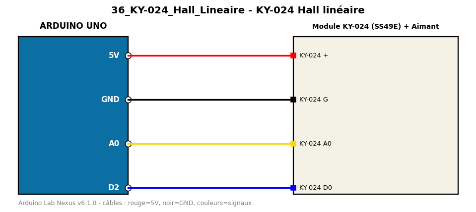

# KY-024 Hall linéaire

Mesure l'intensité et la polarité d'un champ magnétique avec un capteur Hall linéaire KY-024.

**Composants :** Module KY-024 (SS49E), Aimant

**Bibliothèques :** aucune

| Arduino | Composant | Couleur fil |
|---|---|---|
| 5V | KY-024 + | red |
| GND | KY-024 G | black |
| A0 | KY-024 A0 | gold |
| D2 | KY-024 D0 | blue |

Moniteur série : 9600 bauds. Toujours câbler **carte débranchée**.
