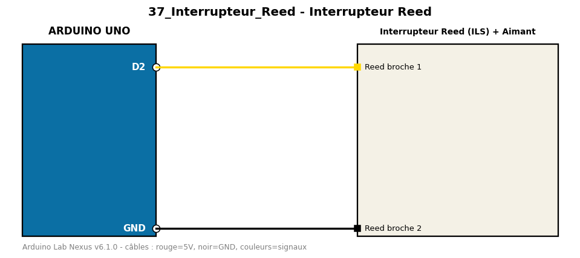

# Interrupteur Reed

Détecte l'ouverture ou la fermeture d'une porte avec un interrupteur Reed et un aimant.

**Composants :** Interrupteur Reed (ILS), Aimant

**Bibliothèques :** aucune

| Arduino | Composant | Couleur fil |
|---|---|---|
| D2 | Reed broche 1 | gold |
| GND | Reed broche 2 | black |

Moniteur série : 9600 bauds. Toujours câbler **carte débranchée**.
