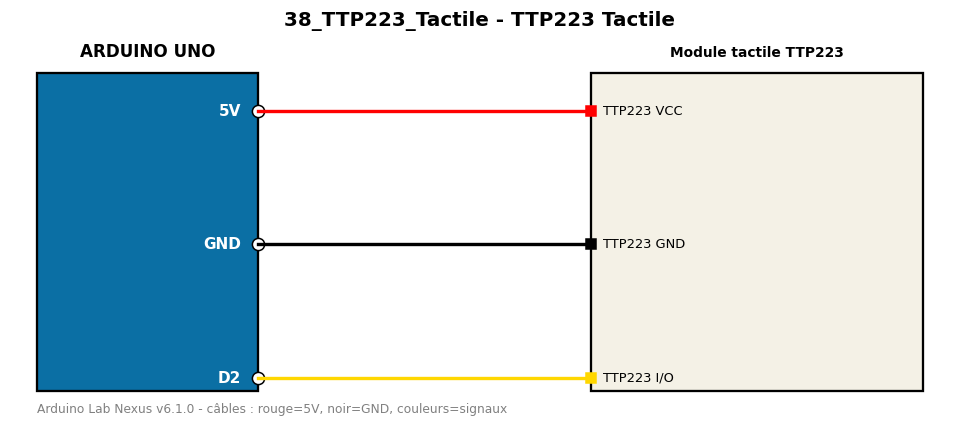

# TTP223 Tactile

Utilise un capteur tactile capacitif TTP223 comme interrupteur marche/arrêt.

**Composants :** Module tactile TTP223

**Bibliothèques :** aucune

| Arduino | Composant | Couleur fil |
|---|---|---|
| 5V | TTP223 VCC | red |
| GND | TTP223 GND | black |
| D2 | TTP223 I/O | gold |

Moniteur série : 9600 bauds. Toujours câbler **carte débranchée**.
