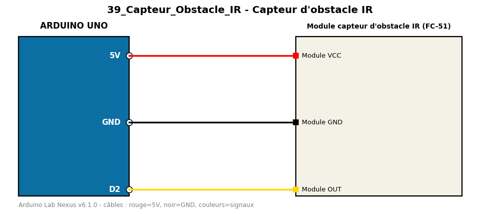

# Capteur d'obstacle IR

Détecte un obstacle proche avec un module infrarouge émetteur/récepteur.

**Composants :** Module capteur d'obstacle IR (FC-51)

**Bibliothèques :** aucune

| Arduino | Composant | Couleur fil |
|---|---|---|
| 5V | Module VCC | red |
| GND | Module GND | black |
| D2 | Module OUT | gold |

Moniteur série : 9600 bauds. Toujours câbler **carte débranchée**.
