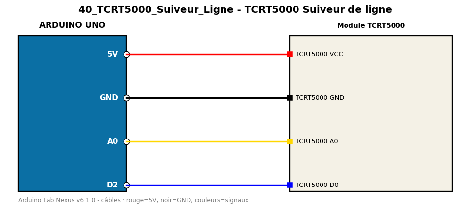

# TCRT5000 Suiveur de ligne

Distingue une ligne noire d'une surface blanche avec un capteur réfléchissant TCRT5000.

**Composants :** Module TCRT5000

**Bibliothèques :** aucune

| Arduino | Composant | Couleur fil |
|---|---|---|
| 5V | TCRT5000 VCC | red |
| GND | TCRT5000 GND | black |
| A0 | TCRT5000 A0 | gold |
| D2 | TCRT5000 D0 | blue |

Moniteur série : 9600 bauds. Toujours câbler **carte débranchée**.
