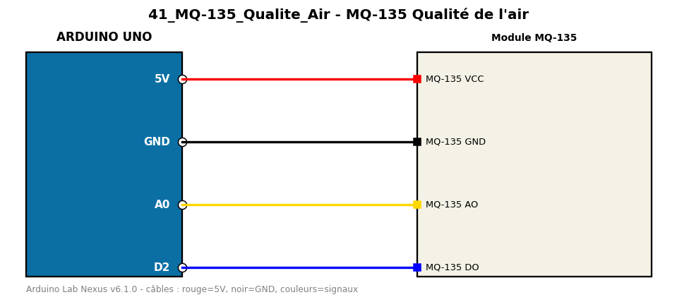

# MQ-135 Qualité de l'air

Mesure un indice relatif de qualité de l'air avec un capteur de gaz MQ-135.

**Composants :** Module MQ-135

**Bibliothèques :** aucune

| Arduino | Composant | Couleur fil |
|---|---|---|
| 5V | MQ-135 VCC | red |
| GND | MQ-135 GND | black |
| A0 | MQ-135 AO | gold |
| D2 | MQ-135 DO | blue |

Moniteur série : 9600 bauds. Toujours câbler **carte débranchée**.
