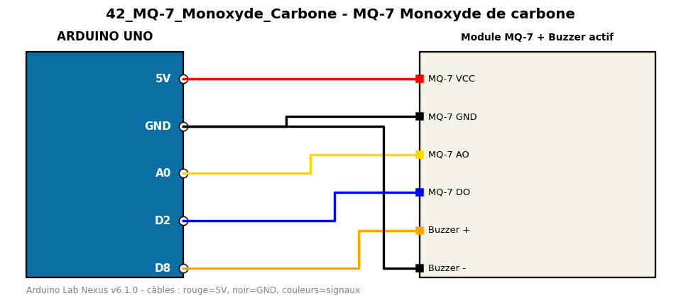

# MQ-7 Monoxyde de carbone

Détecte la présence de monoxyde de carbone (CO) avec un capteur MQ-7 et déclenche une alarme.

**Composants :** Module MQ-7, Buzzer actif

**Bibliothèques :** aucune

| Arduino | Composant | Couleur fil |
|---|---|---|
| 5V | MQ-7 VCC | red |
| GND | MQ-7 GND | black |
| A0 | MQ-7 AO | gold |
| D2 | MQ-7 DO | blue |
| D8 | Buzzer + | orange |
| GND | Buzzer - | black |

Moniteur série : 9600 bauds. Toujours câbler **carte débranchée**.
