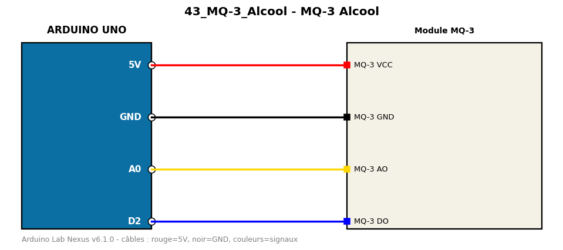

# MQ-3 Alcool

Mesure un taux relatif de vapeur d'alcool avec un capteur MQ-3 (usage pédagogique uniquement).

**Composants :** Module MQ-3

**Bibliothèques :** aucune

| Arduino | Composant | Couleur fil |
|---|---|---|
| 5V | MQ-3 VCC | red |
| GND | MQ-3 GND | black |
| A0 | MQ-3 AO | gold |
| D2 | MQ-3 DO | blue |

Moniteur série : 9600 bauds. Toujours câbler **carte débranchée**.
