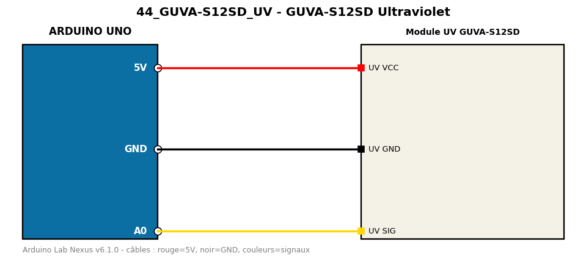

# GUVA-S12SD Ultraviolet

Mesure le rayonnement UV et estime l'indice UV avec un capteur GUVA-S12SD.

**Composants :** Module UV GUVA-S12SD

**Bibliothèques :** aucune

| Arduino | Composant | Couleur fil |
|---|---|---|
| 5V | UV VCC | red |
| GND | UV GND | black |
| A0 | UV SIG | gold |

Moniteur série : 9600 bauds. Toujours câbler **carte débranchée**.
