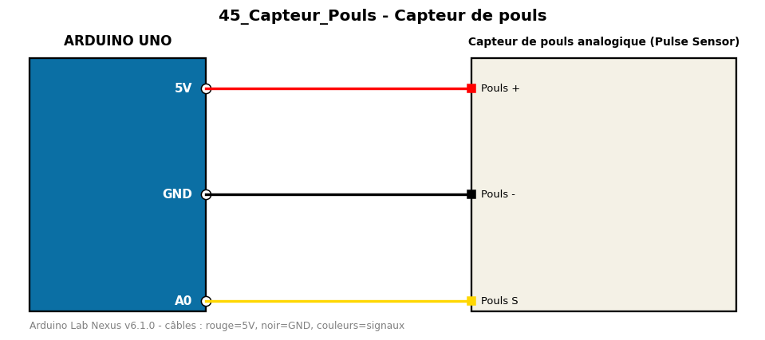

# Capteur de pouls

Détecte les battements cardiaques avec un capteur de pouls analogique et calcule les BPM.

**Composants :** Capteur de pouls analogique (Pulse Sensor)

**Bibliothèques :** aucune

| Arduino | Composant | Couleur fil |
|---|---|---|
| 5V | Pouls + | red |
| GND | Pouls - | black |
| A0 | Pouls S | gold |

Moniteur série : 9600 bauds. Toujours câbler **carte débranchée**.
