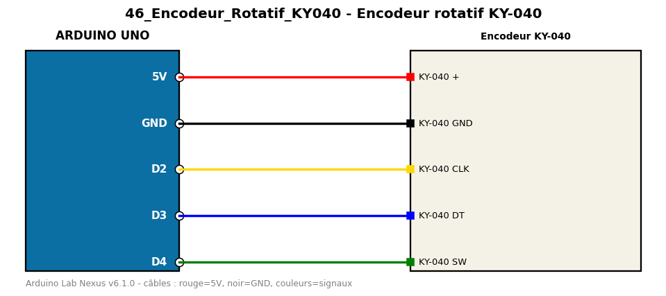

# Encodeur rotatif KY-040

Compte les crans de l'encodeur rotatif et détecte l'appui sur son bouton.

**Composants :** Encodeur KY-040

**Bibliothèques :** aucune

| Arduino | Composant | Couleur fil |
|---|---|---|
| 5V | KY-040 + | red |
| GND | KY-040 GND | black |
| D2 | KY-040 CLK | gold |
| D3 | KY-040 DT | blue |
| D4 | KY-040 SW | green |

Moniteur série : 9600 bauds. Toujours câbler **carte débranchée**.
