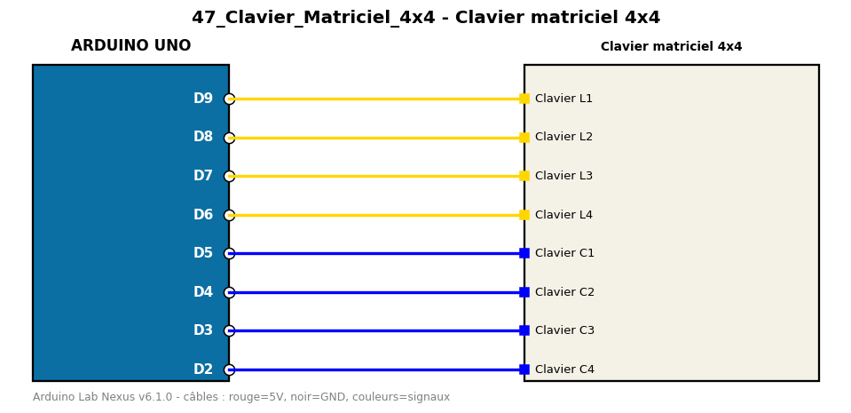

# Clavier matriciel 4x4

Affiche sur le moniteur série la touche appuyée sur un clavier 4x4.

**Composants :** Clavier matriciel 4x4

**Bibliothèques :** Keypad

| Arduino | Composant | Couleur fil |
|---|---|---|
| D9 | Clavier L1 | gold |
| D8 | Clavier L2 | gold |
| D7 | Clavier L3 | gold |
| D6 | Clavier L4 | gold |
| D5 | Clavier C1 | blue |
| D4 | Clavier C2 | blue |
| D3 | Clavier C3 | blue |
| D2 | Clavier C4 | blue |

Moniteur série : 9600 bauds. Toujours câbler **carte débranchée**.
