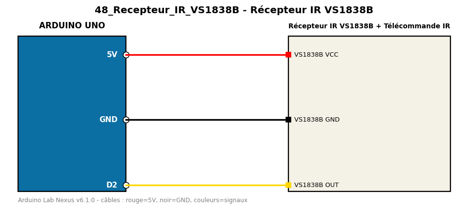

# Récepteur IR VS1838B

Décode les codes d'une télécommande infrarouge et les affiche.

**Composants :** Récepteur IR VS1838B, Télécommande IR

**Bibliothèques :** IRremote

| Arduino | Composant | Couleur fil |
|---|---|---|
| 5V | VS1838B VCC | red |
| GND | VS1838B GND | black |
| D2 | VS1838B OUT | gold |

Moniteur série : 9600 bauds. Toujours câbler **carte débranchée**.
