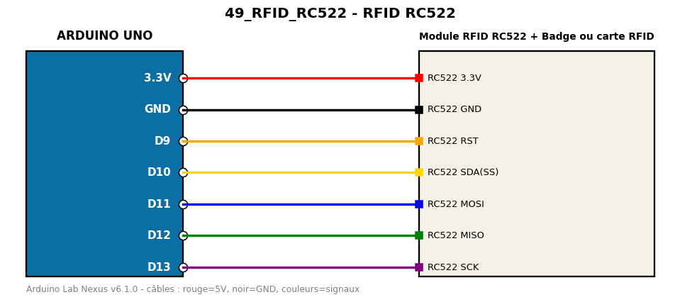

# RFID RC522

Lit l'identifiant (UID) des badges RFID 13,56 MHz.

**Composants :** Module RFID RC522, Badge ou carte RFID

**Bibliothèques :** MFRC522

| Arduino | Composant | Couleur fil |
|---|---|---|
| 3.3V | RC522 3.3V | red |
| GND | RC522 GND | black |
| D9 | RC522 RST | orange |
| D10 | RC522 SDA(SS) | gold |
| D11 | RC522 MOSI | blue |
| D12 | RC522 MISO | green |
| D13 | RC522 SCK | purple |

Moniteur série : 9600 bauds. Toujours câbler **carte débranchée**.
