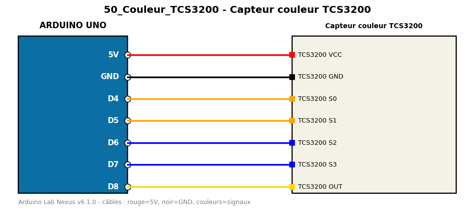

# Capteur couleur TCS3200

Mesure les composantes rouge, verte et bleue d'une surface avec pulseIn.

**Composants :** Capteur couleur TCS3200

**Bibliothèques :** aucune

| Arduino | Composant | Couleur fil |
|---|---|---|
| 5V | TCS3200 VCC | red |
| GND | TCS3200 GND | black |
| D4 | TCS3200 S0 | orange |
| D5 | TCS3200 S1 | orange |
| D6 | TCS3200 S2 | blue |
| D7 | TCS3200 S3 | blue |
| D8 | TCS3200 OUT | gold |

Moniteur série : 9600 bauds. Toujours câbler **carte débranchée**.
