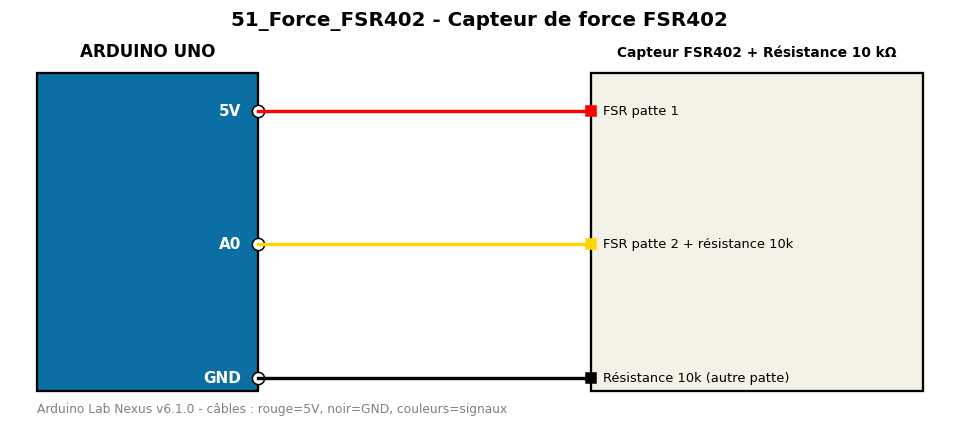

# Capteur de force FSR402

Mesure la pression exercée sur une résistance sensible à la force.

**Composants :** Capteur FSR402, Résistance 10 kΩ

**Bibliothèques :** aucune

| Arduino | Composant | Couleur fil |
|---|---|---|
| 5V | FSR patte 1 | red |
| A0 | FSR patte 2 + résistance 10k | gold |
| GND | Résistance 10k (autre patte) | black |

Moniteur série : 9600 bauds. Toujours câbler **carte débranchée**.
