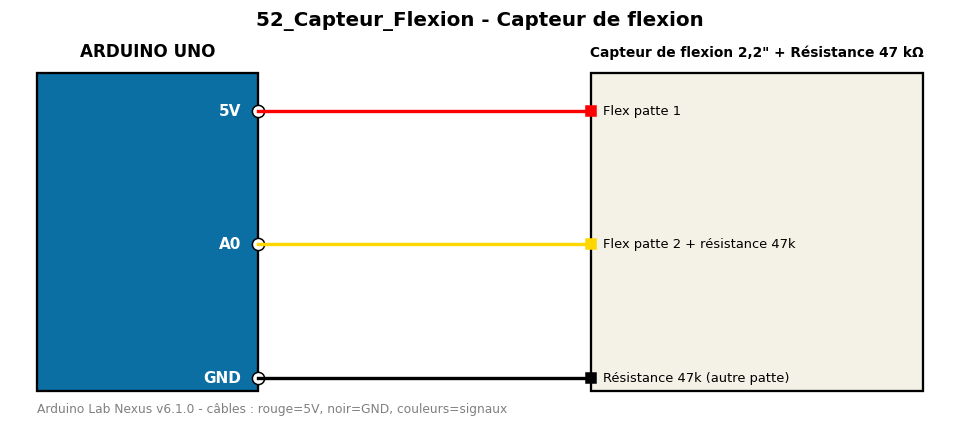

# Capteur de flexion

Mesure l'angle de pliage d'un capteur de flexion (flex sensor).

**Composants :** Capteur de flexion 2,2", Résistance 47 kΩ

**Bibliothèques :** aucune

| Arduino | Composant | Couleur fil |
|---|---|---|
| 5V | Flex patte 1 | red |
| A0 | Flex patte 2 + résistance 47k | gold |
| GND | Résistance 47k (autre patte) | black |

Moniteur série : 9600 bauds. Toujours câbler **carte débranchée**.
