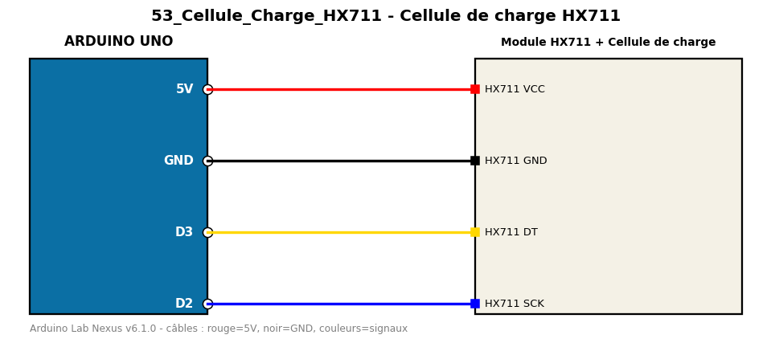

# Cellule de charge HX711

Pèse un objet avec une cellule de charge et l'amplificateur HX711.

**Composants :** Module HX711, Cellule de charge

**Bibliothèques :** HX711 Arduino Library

| Arduino | Composant | Couleur fil |
|---|---|---|
| 5V | HX711 VCC | red |
| GND | HX711 GND | black |
| D3 | HX711 DT | gold |
| D2 | HX711 SCK | blue |

Moniteur série : 9600 bauds. Toujours câbler **carte débranchée**.
