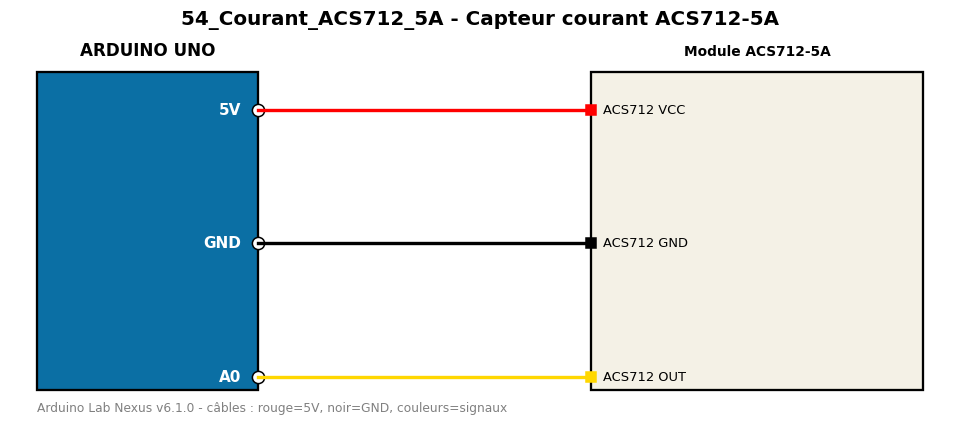

# Capteur courant ACS712-5A

Mesure un courant continu jusqu'à 5 A avec un capteur à effet Hall.

**Composants :** Module ACS712-5A

**Bibliothèques :** aucune

| Arduino | Composant | Couleur fil |
|---|---|---|
| 5V | ACS712 VCC | red |
| GND | ACS712 GND | black |
| A0 | ACS712 OUT | gold |

Moniteur série : 9600 bauds. Toujours câbler **carte débranchée**.
