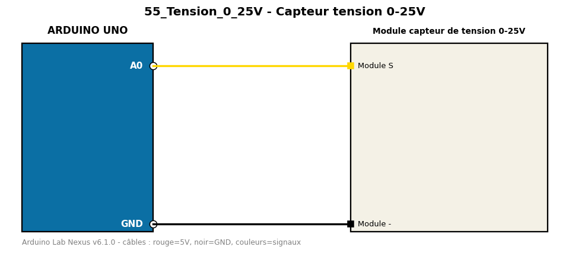

# Capteur tension 0-25V

Mesure une tension jusqu'à 25 V grâce à un pont diviseur 30k/7,5k.

**Composants :** Module capteur de tension 0-25V

**Bibliothèques :** aucune

| Arduino | Composant | Couleur fil |
|---|---|---|
| A0 | Module S | gold |
| GND | Module - | black |

Moniteur série : 9600 bauds. Toujours câbler **carte débranchée**.
