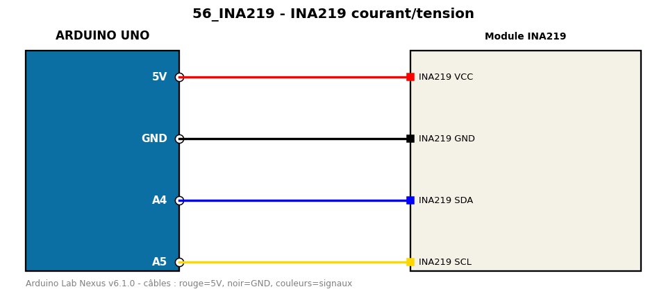

# INA219 courant/tension

Mesure tension, courant et puissance d'une charge via I2C.

**Composants :** Module INA219

**Bibliothèques :** Adafruit INA219, Adafruit BusIO

| Arduino | Composant | Couleur fil |
|---|---|---|
| 5V | INA219 VCC | red |
| GND | INA219 GND | black |
| A4 | INA219 SDA | blue |
| A5 | INA219 SCL | gold |

Moniteur série : 9600 bauds. Toujours câbler **carte débranchée**.
