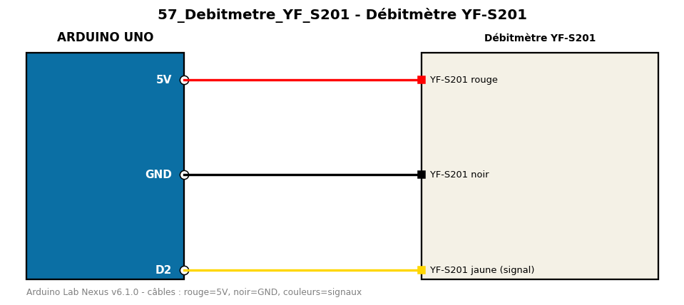

# Débitmètre YF-S201

Mesure le débit d'eau en comptant les impulsions par interruption.

**Composants :** Débitmètre YF-S201

**Bibliothèques :** aucune

| Arduino | Composant | Couleur fil |
|---|---|---|
| 5V | YF-S201 rouge | red |
| GND | YF-S201 noir | black |
| D2 | YF-S201 jaune (signal) | gold |

Moniteur série : 9600 bauds. Toujours câbler **carte débranchée**.
