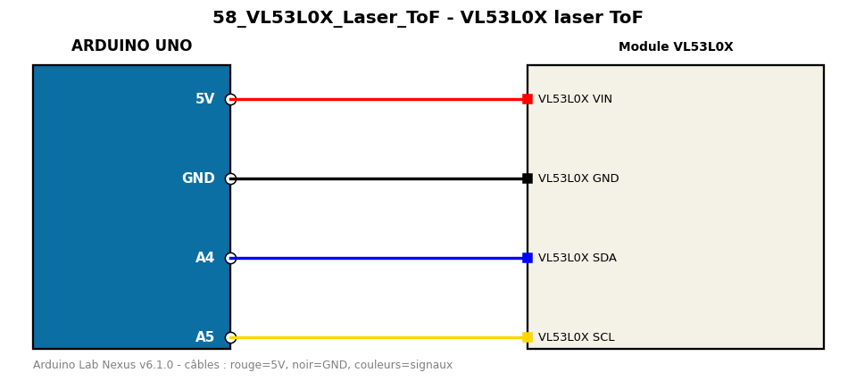

# VL53L0X laser ToF

Mesure une distance jusqu'à 2 m par temps de vol laser.

**Composants :** Module VL53L0X

**Bibliothèques :** VL53L0X

| Arduino | Composant | Couleur fil |
|---|---|---|
| 5V | VL53L0X VIN | red |
| GND | VL53L0X GND | black |
| A4 | VL53L0X SDA | blue |
| A5 | VL53L0X SCL | gold |

Moniteur série : 9600 bauds. Toujours câbler **carte débranchée**.
