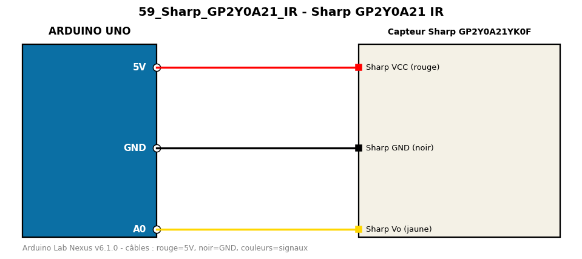

# Sharp GP2Y0A21 IR

Mesure une distance de 10 à 80 cm avec un capteur infrarouge analogique.

**Composants :** Capteur Sharp GP2Y0A21YK0F

**Bibliothèques :** aucune

| Arduino | Composant | Couleur fil |
|---|---|---|
| 5V | Sharp VCC (rouge) | red |
| GND | Sharp GND (noir) | black |
| A0 | Sharp Vo (jaune) | gold |

Moniteur série : 9600 bauds. Toujours câbler **carte débranchée**.
