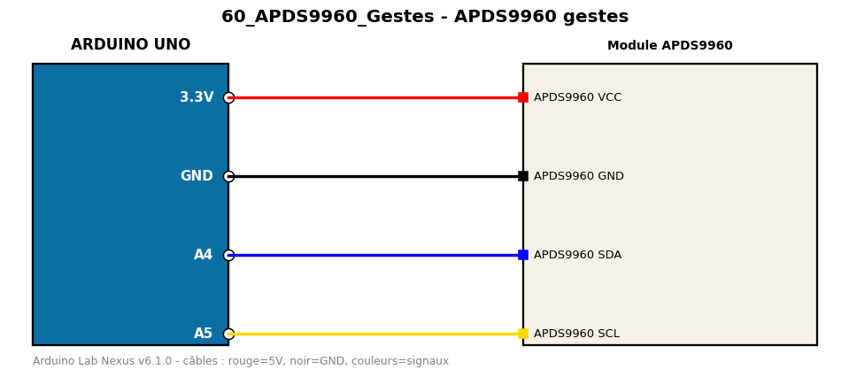

# APDS9960 gestes

Détecte les gestes de la main (haut, bas, gauche, droite).

**Composants :** Module APDS9960

**Bibliothèques :** Adafruit APDS9960 Library, Adafruit BusIO

| Arduino | Composant | Couleur fil |
|---|---|---|
| 3.3V | APDS9960 VCC | red |
| GND | APDS9960 GND | black |
| A4 | APDS9960 SDA | blue |
| A5 | APDS9960 SCL | gold |

Moniteur série : 9600 bauds. Toujours câbler **carte débranchée**.
