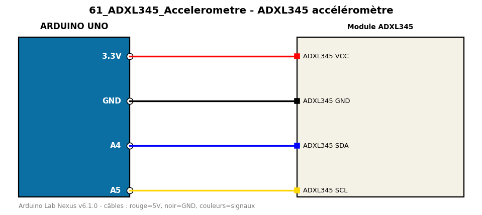

# ADXL345 accéléromètre

Lit l'accélération sur 3 axes en I2C sans bibliothèque.

**Composants :** Module ADXL345

**Bibliothèques :** aucune

| Arduino | Composant | Couleur fil |
|---|---|---|
| 3.3V | ADXL345 VCC | red |
| GND | ADXL345 GND | black |
| A4 | ADXL345 SDA | blue |
| A5 | ADXL345 SCL | gold |

Moniteur série : 9600 bauds. Toujours câbler **carte débranchée**.
