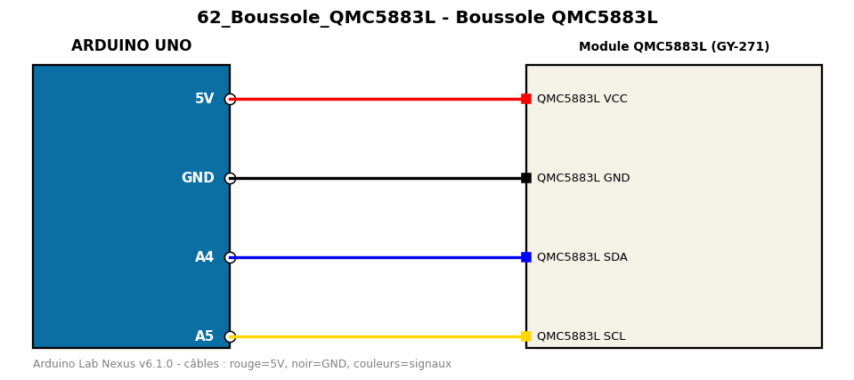

# Boussole QMC5883L

Calcule le cap magnétique en degrés avec le magnétomètre QMC5883L (I2C brut).

**Composants :** Module QMC5883L (GY-271)

**Bibliothèques :** aucune

| Arduino | Composant | Couleur fil |
|---|---|---|
| 5V | QMC5883L VCC | red |
| GND | QMC5883L GND | black |
| A4 | QMC5883L SDA | blue |
| A5 | QMC5883L SCL | gold |

Moniteur série : 9600 bauds. Toujours câbler **carte débranchée**.
