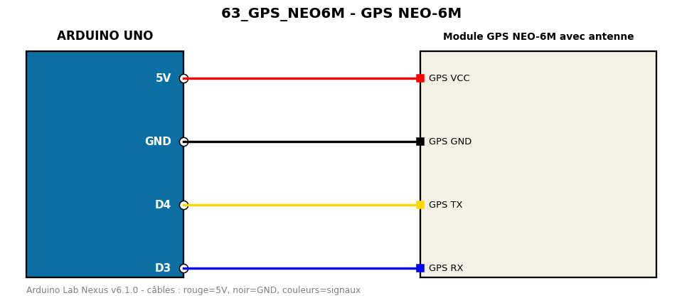

# GPS NEO-6M

Affiche latitude, longitude et nombre de satellites reçus par le GPS.

**Composants :** Module GPS NEO-6M avec antenne

**Bibliothèques :** TinyGPSPlus

| Arduino | Composant | Couleur fil |
|---|---|---|
| 5V | GPS VCC | red |
| GND | GPS GND | black |
| D4 | GPS TX | gold |
| D3 | GPS RX | blue |

Moniteur série : 9600 bauds. Toujours câbler **carte débranchée**.
