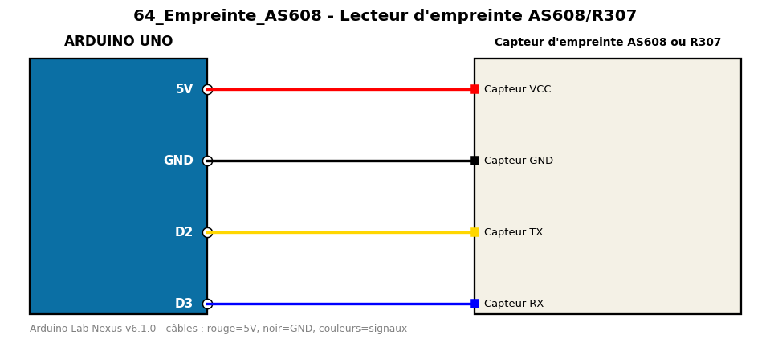

# Lecteur d'empreinte AS608/R307

Reconnaît une empreinte digitale déjà enregistrée dans le capteur.

**Composants :** Capteur d'empreinte AS608 ou R307

**Bibliothèques :** Adafruit Fingerprint Sensor Library

| Arduino | Composant | Couleur fil |
|---|---|---|
| 5V | Capteur VCC | red |
| GND | Capteur GND | black |
| D2 | Capteur TX | gold |
| D3 | Capteur RX | blue |

Moniteur série : 9600 bauds. Toujours câbler **carte débranchée**.
