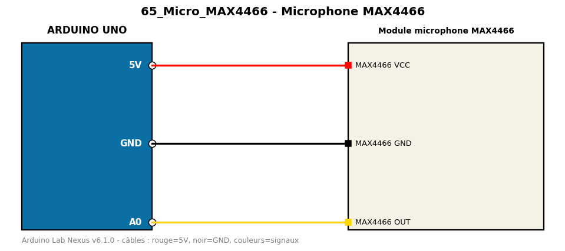

# Microphone MAX4466

Mesure le niveau sonore crête à crête sur une fenêtre de 50 ms.

**Composants :** Module microphone MAX4466

**Bibliothèques :** aucune

| Arduino | Composant | Couleur fil |
|---|---|---|
| 5V | MAX4466 VCC | red |
| GND | MAX4466 GND | black |
| A0 | MAX4466 OUT | gold |

Moniteur série : 9600 bauds. Toujours câbler **carte débranchée**.
