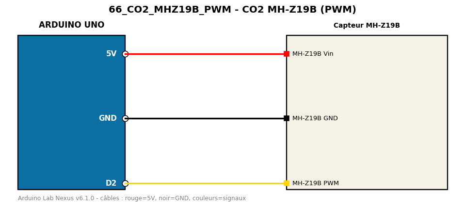

# CO2 MH-Z19B (PWM)

Mesure la concentration de CO2 en lisant la sortie PWM du MH-Z19B.

**Composants :** Capteur MH-Z19B

**Bibliothèques :** aucune

| Arduino | Composant | Couleur fil |
|---|---|---|
| 5V | MH-Z19B Vin | red |
| GND | MH-Z19B GND | black |
| D2 | MH-Z19B PWM | gold |

Moniteur série : 9600 bauds. Toujours câbler **carte débranchée**.
