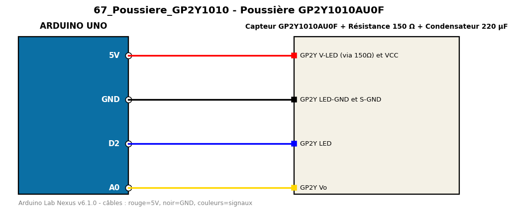

# Poussière GP2Y1010AU0F

Estime la densité de poussière dans l'air avec le capteur optique Sharp.

**Composants :** Capteur GP2Y1010AU0F, Résistance 150 Ω, Condensateur 220 µF

**Bibliothèques :** aucune

| Arduino | Composant | Couleur fil |
|---|---|---|
| 5V | GP2Y V-LED (via 150Ω) et VCC | red |
| GND | GP2Y LED-GND et S-GND | black |
| D2 | GP2Y LED | blue |
| A0 | GP2Y Vo | gold |

Moniteur série : 9600 bauds. Toujours câbler **carte débranchée**.
