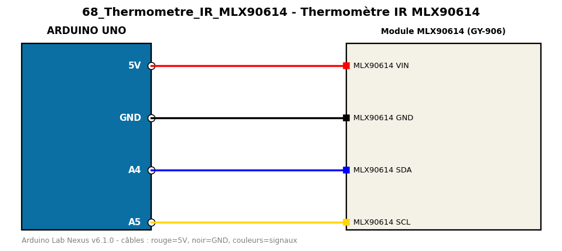

# Thermomètre IR MLX90614

Mesure sans contact la température d'un objet et la température ambiante.

**Composants :** Module MLX90614 (GY-906)

**Bibliothèques :** Adafruit MLX90614 Library, Adafruit BusIO

| Arduino | Composant | Couleur fil |
|---|---|---|
| 5V | MLX90614 VIN | red |
| GND | MLX90614 GND | black |
| A4 | MLX90614 SDA | blue |
| A5 | MLX90614 SCL | gold |

Moniteur série : 9600 bauds. Toujours câbler **carte débranchée**.
