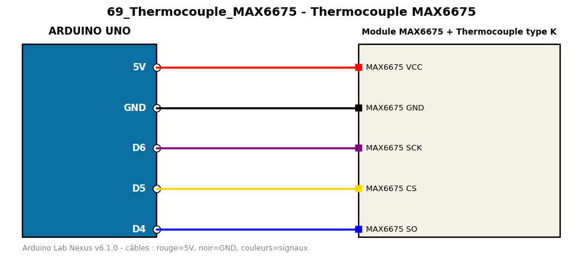

# Thermocouple MAX6675

Mesure des températures élevées (jusqu'à 1024 °C) avec un thermocouple type K.

**Composants :** Module MAX6675, Thermocouple type K

**Bibliothèques :** MAX6675 library

| Arduino | Composant | Couleur fil |
|---|---|---|
| 5V | MAX6675 VCC | red |
| GND | MAX6675 GND | black |
| D6 | MAX6675 SCK | purple |
| D5 | MAX6675 CS | gold |
| D4 | MAX6675 SO | blue |

Moniteur série : 9600 bauds. Toujours câbler **carte débranchée**.
