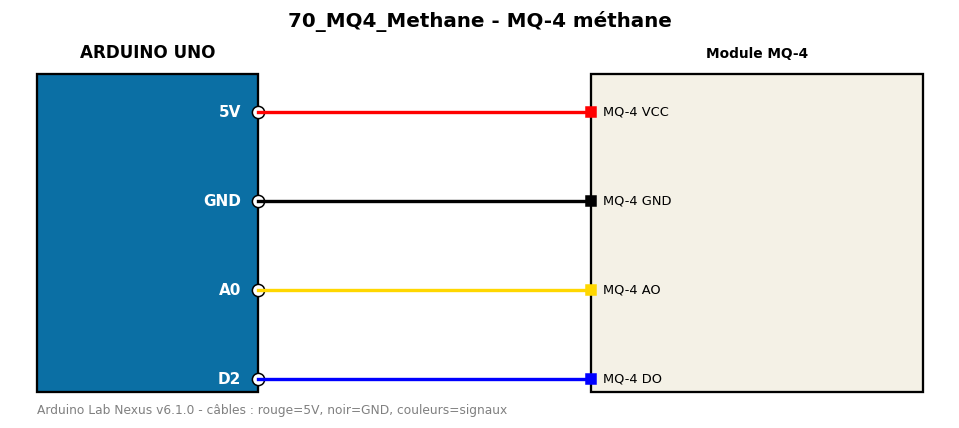

# MQ-4 méthane

Détecte la présence de méthane (gaz naturel) avec le capteur MQ-4.

**Composants :** Module MQ-4

**Bibliothèques :** aucune

| Arduino | Composant | Couleur fil |
|---|---|---|
| 5V | MQ-4 VCC | red |
| GND | MQ-4 GND | black |
| A0 | MQ-4 AO | gold |
| D2 | MQ-4 DO | blue |

Moniteur série : 9600 bauds. Toujours câbler **carte débranchée**.
