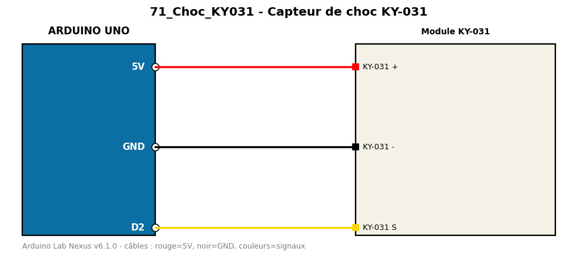

# Capteur de choc KY-031

Détecte les chocs et vibrations et les compte.

**Composants :** Module KY-031

**Bibliothèques :** aucune

| Arduino | Composant | Couleur fil |
|---|---|---|
| 5V | KY-031 + | red |
| GND | KY-031 - | black |
| D2 | KY-031 S | gold |

Moniteur série : 9600 bauds. Toujours câbler **carte débranchée**.
