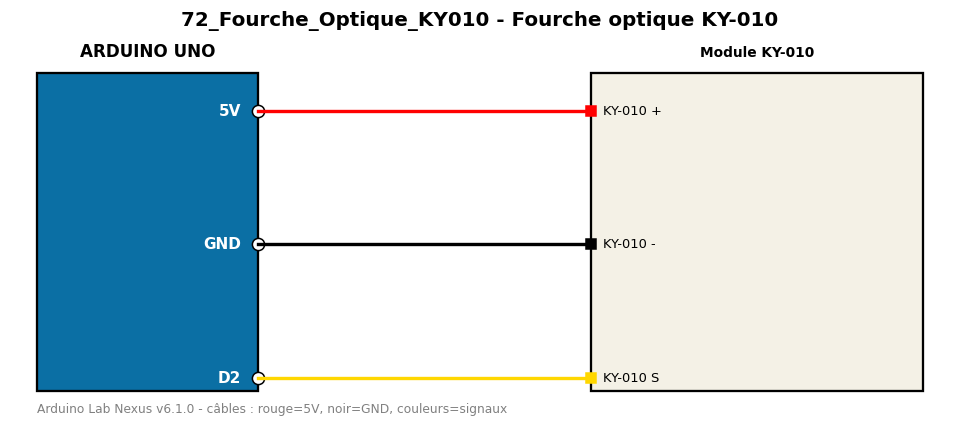

# Fourche optique KY-010

Compte les passages d'un objet dans la fourche optique.

**Composants :** Module KY-010

**Bibliothèques :** aucune

| Arduino | Composant | Couleur fil |
|---|---|---|
| 5V | KY-010 + | red |
| GND | KY-010 - | black |
| D2 | KY-010 S | gold |

Moniteur série : 9600 bauds. Toujours câbler **carte débranchée**.
