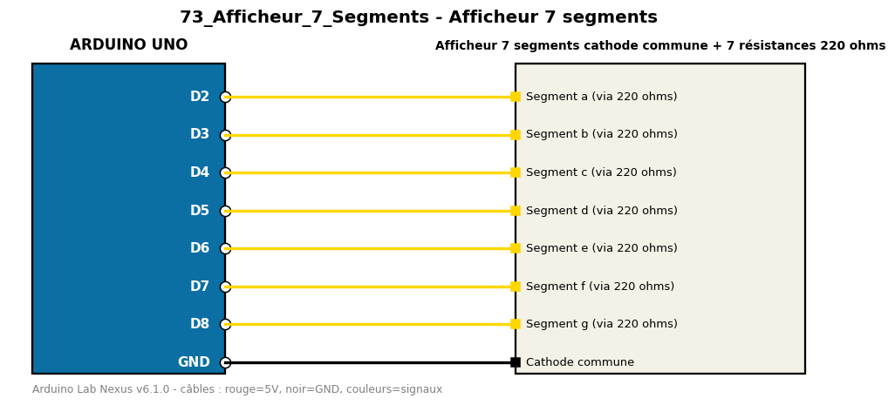

# Afficheur 7 segments

Compte de 0 à 9 sur un afficheur 7 segments à cathode commune, sans bibliothèque.

**Composants :** Afficheur 7 segments cathode commune, 7 résistances 220 ohms

**Bibliothèques :** aucune

| Arduino | Composant | Couleur fil |
|---|---|---|
| D2 | Segment a (via 220 ohms) | gold |
| D3 | Segment b (via 220 ohms) | gold |
| D4 | Segment c (via 220 ohms) | gold |
| D5 | Segment d (via 220 ohms) | gold |
| D6 | Segment e (via 220 ohms) | gold |
| D7 | Segment f (via 220 ohms) | gold |
| D8 | Segment g (via 220 ohms) | gold |
| GND | Cathode commune | black |

Moniteur série : 9600 bauds. Toujours câbler **carte débranchée**.
