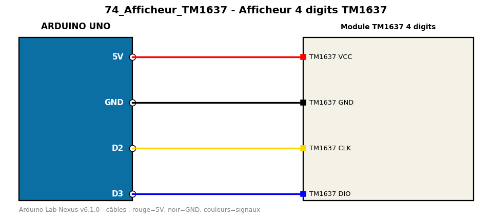

# Afficheur 4 digits TM1637

Affiche un compteur sur un afficheur 4 chiffres TM1637.

**Composants :** Module TM1637 4 digits

**Bibliothèques :** TM1637

| Arduino | Composant | Couleur fil |
|---|---|---|
| 5V | TM1637 VCC | red |
| GND | TM1637 GND | black |
| D2 | TM1637 CLK | gold |
| D3 | TM1637 DIO | blue |

Moniteur série : 9600 bauds. Toujours câbler **carte débranchée**.
