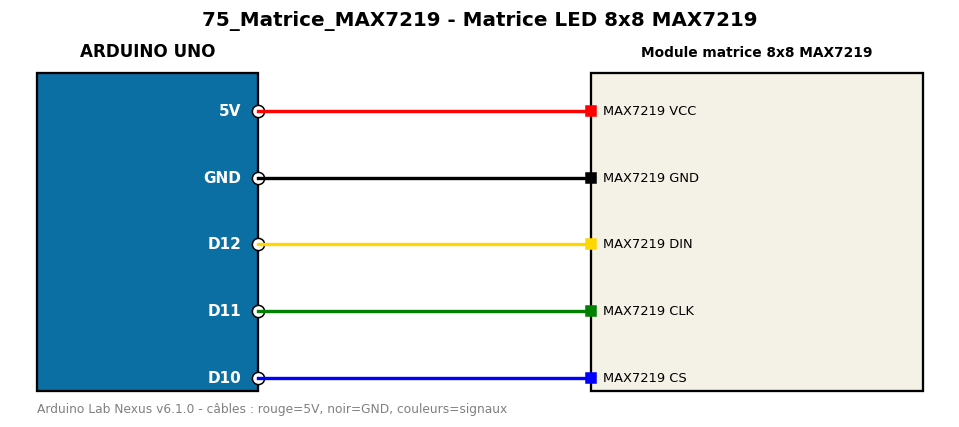

# Matrice LED 8x8 MAX7219

Affiche un smiley puis un cœur sur une matrice 8x8 pilotée par MAX7219.

**Composants :** Module matrice 8x8 MAX7219

**Bibliothèques :** LedControl

| Arduino | Composant | Couleur fil |
|---|---|---|
| 5V | MAX7219 VCC | red |
| GND | MAX7219 GND | black |
| D12 | MAX7219 DIN | gold |
| D11 | MAX7219 CLK | green |
| D10 | MAX7219 CS | blue |

Moniteur série : 9600 bauds. Toujours câbler **carte débranchée**.
