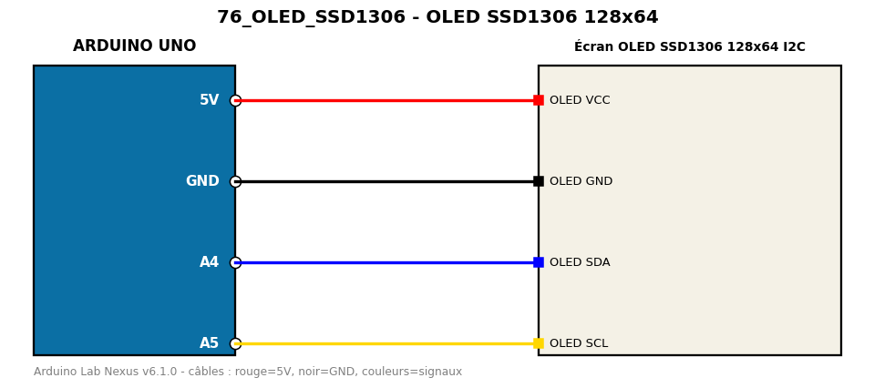

# OLED SSD1306 128x64

Affiche un texte et un compteur sur un écran OLED I2C 128x64.

**Composants :** Écran OLED SSD1306 128x64 I2C

**Bibliothèques :** Adafruit SSD1306, Adafruit GFX Library, Adafruit BusIO

| Arduino | Composant | Couleur fil |
|---|---|---|
| 5V | OLED VCC | red |
| GND | OLED GND | black |
| A4 | OLED SDA | blue |
| A5 | OLED SCL | gold |

Moniteur série : 9600 bauds. Toujours câbler **carte débranchée**.
