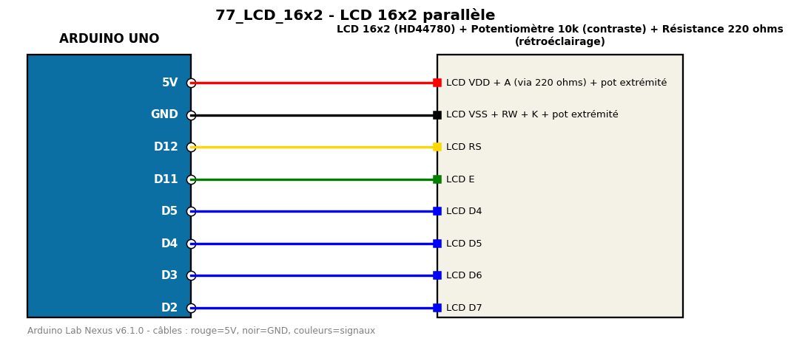

# LCD 16x2 parallèle

Affiche un message et le temps écoulé sur un LCD 16x2 en mode 4 bits.

**Composants :** LCD 16x2 (HD44780), Potentiomètre 10k (contraste), Résistance 220 ohms (rétroéclairage)

**Bibliothèques :** LiquidCrystal

| Arduino | Composant | Couleur fil |
|---|---|---|
| 5V | LCD VDD + A (via 220 ohms) + pot extrémité | red |
| GND | LCD VSS + RW + K + pot extrémité | black |
| D12 | LCD RS | gold |
| D11 | LCD E | green |
| D5 | LCD D4 | blue |
| D4 | LCD D5 | blue |
| D3 | LCD D6 | blue |
| D2 | LCD D7 | blue |

Moniteur série : 9600 bauds. Toujours câbler **carte débranchée**.
