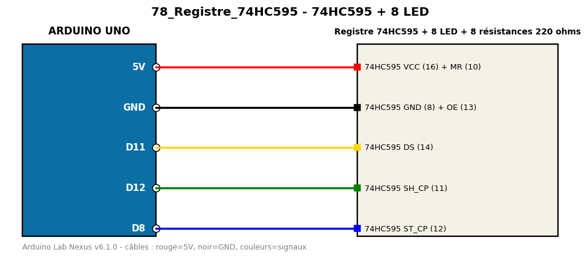

# 74HC595 + 8 LED

Pilote 8 LED avec seulement 3 broches grâce au registre à décalage 74HC595.

**Composants :** Registre 74HC595, 8 LED, 8 résistances 220 ohms

**Bibliothèques :** aucune

| Arduino | Composant | Couleur fil |
|---|---|---|
| 5V | 74HC595 VCC (16) + MR (10) | red |
| GND | 74HC595 GND (8) + OE (13) | black |
| D11 | 74HC595 DS (14) | gold |
| D12 | 74HC595 SH_CP (11) | green |
| D8 | 74HC595 ST_CP (12) | blue |

Moniteur série : 9600 bauds. Toujours câbler **carte débranchée**.
